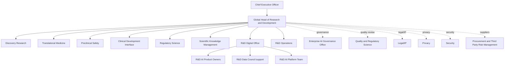

# ACME Pharma R&D organization chart and governance map

**Record owner:** R&D Digital Office
**Approver:** EVP Research and Development
**Status:** Version 1.0, approved
**Effective or as-of date:** 1 January 2026
**Review cycle:** Annual

## Company and R&D footprint

ACME Pharma has about 50,000 employees globally. The R&D organization has about 9,000 employees across discovery, translational science, preclinical safety, clinical development interfaces, regulatory science, biomarker science, scientific knowledge management, and R&D digital platforms.

The R&D AI governance program focuses on AI tools used before marketing authorization and before broad production deployment. The scope includes formal pilots, supplier-supported prototypes, and potential shadow AI use by research teams.

## R&D organization

## Key governance forums

| Forum | Chair | Main decision rights | Role in governance |
|---|---|---|---|
| R&D AI Steering Committee | Global Head of R&D delegate | Prioritizes use cases, approves pilot expansion, resolves ownership conflicts | Confirms whether AI use is business-led and risk-aware |
| Enterprise AI Governance Office | Head of Enterprise AI Governance | Sets enterprise requirements and reviews escalated intended-use and lifecycle decisions | Maintains consistent enterprise governance |
| R&D Data Council | R&D Data Council Chair | Approves data classes, source systems, retention, and data quality expectations | Controls use of restricted research information |
| GxP Boundary Review | Quality and Regulatory Science | Decides whether a use case affects GxP records, submission support, or validated processes | Critical for Part 11, data integrity, and validation/assurance scope |
| Supplier Co-Development Review | Procurement, TPRM, Legal/IP | Reviews contracts, no-training restrictions, support access, derived artifacts, and exit | Central to third-party and shared-responsibility risk |
| Research Integrity Committee | Senior scientists and R&D Quality | Reviews scientific use, source evidence, negative results, and human accountability | Helps distinguish AI assistance from scientific judgment |

## Current coordination dependency

Accountability is distributed across R&D, AI Governance, Quality, Regulatory, Legal/IP, Security, Privacy, and Procurement. Cross-functional decisions are therefore routed through the R&D AI Steering Committee before a pilot expands or changes its approved data or intended-use boundary.

## Operating implications of the organization model

The R&D organization is matrixed. Scientific teams own research decisions, R&D Digital owns platforms, Quality owns regulated-system expectations, Legal/IP owns ownership and confidentiality positions, Privacy owns personal-data screening, and Security owns technical controls. AI Governance sets enterprise expectations, while the R&D Digital Office maintains the linked use-case and system inventories needed to connect the path from idea to system to supplier to output reuse.

The R&D AI Steering Committee is expected to resolve cross-functional decisions. It reviews high-risk use cases, supplier co-development, GxP boundary questions, and expansion from pilot to routine use. The R&D Digital Office maintains the inventories and coordinates evidence collection, but business sponsors remain accountable for intended use and human review.
