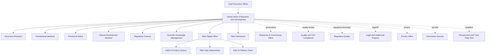

# ACME Pharma R&D organization chart and governance map

## Company and R&D footprint

ACME Pharma has about 80,000 employees globally. The R&D organization has about 14,500 employees across discovery, translational science, preclinical safety, clinical development interfaces, regulatory science, biomarker science, scientific knowledge management, and R&D digital platforms.

The AI-in-R&D audit focuses on AI tools used before marketing authorization and before broad production deployment. The scope includes formal pilots, supplier-supported prototypes, and potential shadow AI use by research teams.

## R&D organization under audit

## Key governance forums

| Forum | Chair | Main decision rights | Audit relevance |
|---|---|---|---|
| R&D AI Steering Committee | Global Head of R&D delegate | Prioritizes use cases, approves pilot expansion, resolves ownership conflicts | Confirms whether AI use is business-led and risk-aware |
| AI Governance Review Board | Enterprise AI Governance Office | Reviews intended use, model lifecycle, monitoring, and responsible AI controls | Tests whether use cases are inventoried and governed consistently |
| R&D Data Council | R&D Data Stewardship | Approves data classes, source systems, retention, and data quality expectations | Determines whether restricted research data is controlled before AI use |
| GxP Boundary Review | Quality and Regulatory Science | Decides whether a use case affects GxP records, submission support, or validated processes | Critical for Part 11, data integrity, and validation/assurance scope |
| Supplier Co-Development Review | Procurement, TPRM, Legal/IP | Reviews contracts, no-training restrictions, support access, derived artifacts, and exit | Central to third-party and shared-responsibility risk |
| Research Integrity Committee | Senior scientists and R&D Quality | Reviews scientific use, source evidence, negative results, and human accountability | Helps distinguish AI assistance from scientific judgment |

## Interview map for audit planning

1. Global R&D strategy owner: why the AI program exists and what expansion means.
2. R&D Digital Office: use-case inventory, product ownership, roadmap, and pilot controls.
3. Data Stewardship: data classification, source approvals, retention, and quality rules.
4. Quality and Regulatory Science: GxP trigger decisions, Part 11 implications, and validation approach.
5. Legal/IP: no-training clauses, co-developed artifacts, inventorship, privilege, and exit rights.
6. Privacy and Security: personal data, cloud architecture, logging, support access, and incident response.
7. Third Party Risk and Procurement: supplier due diligence, subprocessor transparency, and contractual evidence.
8. Research users and scientific reviewers: actual use, review quality, shadow AI pressure, and decision impact.

## Planning risk note

The org chart creates a planning risk by itself: accountability is spread across R&D, AI Governance, Quality, Regulatory, Legal/IP, Security, Privacy, and Procurement. If the pilot expands faster than these functions coordinate, the company may have strong individual controls but weak end-to-end accountability.

## Operating implications of the organization model

The R&D organization is matrixed. Scientific teams own research decisions, R&D Digital owns platforms, Quality owns regulated-system expectations, Legal/IP owns ownership and confidentiality positions, Privacy owns personal-data screening, and Security owns technical controls. AI Governance sets enterprise expectations, but it does not directly operate every R&D use case. This creates a coordination risk: no single function sees the complete path from idea to system to supplier to output reuse.

The R&D AI Steering Forum is expected to resolve cross-functional decisions. It reviews high-risk use cases, supplier co-development, GxP boundary questions, and expansion from pilot to routine use. The R&D Digital Office maintains the inventories and coordinates evidence collection, but business sponsors remain accountable for intended use and human review.

## Audit focus from org design

The audit should test handoffs. A use case can pass Digital review but still lack Legal/IP clarity. A supplier can pass procurement checks but still lack scientific output-review controls. A governance forum can approve a pilot but fail to monitor actual use. The organization chart should therefore be used to identify expected evidence owners, not only reporting lines.

A practical audit test is to trace Project NEURALIS across the organization: sponsor approval, Digital design, Legal/IP review, Privacy screening, Security assessment, Quality boundary conclusion, Procurement contract, supplier access, reviewer feedback, and steering decision. Missing handoffs would show where governance breaks down.